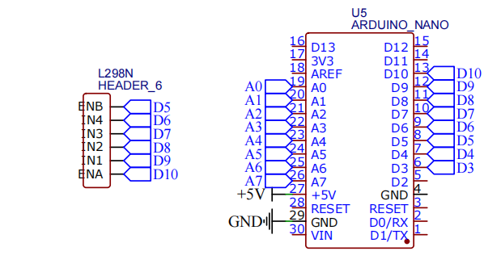
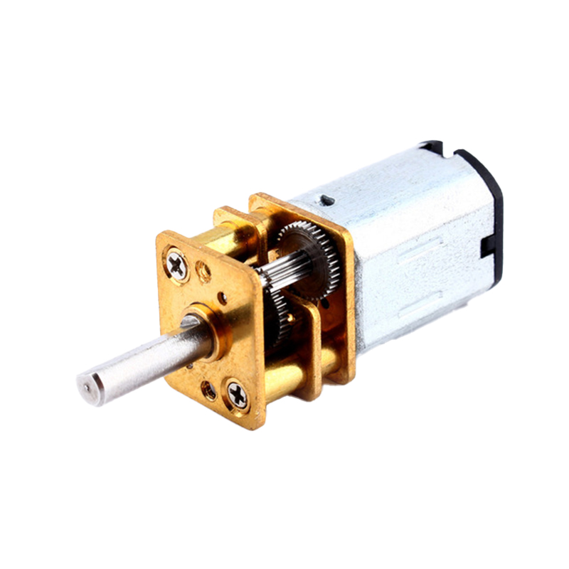

# ⚙️ Motor Driver & Motors Testing

## L298N Motor Driver with N20 Gear Motors

[](https://www.arduino.cc/)
[](https://github.com)
[](https://github.com)

> **Part of:** Advanced Line Follower Robot Project  
> **Purpose:** Testing motor driver and N20 gear motors for precise movement control

---

## 🎯 Objective

Test the L298N H-Bridge motor driver with dual N20 gear motors to achieve:
- Forward and reverse movement
- Speed control using PWM
- Individual motor control
- Verify safe operating speeds for the robot chassis

---

## 🔧 Components Used

| Component | Specification | Quantity |
|-----------|--------------|----------|
| Microcontroller | Arduino Nano | 1 |
| Motor Driver | L298N H-Bridge Module | 1 |
| Motors | N20 Gear Motor, 600 RPM, 12V | 2 |
| Power Supply | 12V Li-ion Battery | 1 |
| Jumper Wires | Male-to-Male / Female-to-Male | 10+ |

---

## 📊 Component Specifications

### N20 Gear Motor (600 RPM)

| Parameter | Value |
|-----------|-------|
| Operating Voltage | 12V DC |
| No-Load Speed | 600 RPM |
| No-Load Current | ~70mA |
| Rated Torque | 0.8 kg·cm |
| Stall Current | ~300mA |
| Shaft Diameter | 3mm (D-shaped) |
| Gear Ratio | 1:50 (typical) |
| Motor Type | DC Brushed |

### L298N Motor Driver Module

| Feature | Specification |
|---------|---------------|
| Driver Chip | L298N Dual H-Bridge |
| Motor Channels | 2 (Motor A & Motor B) |
| Max Motor Voltage | 12V - 35V |
| Max Current per Channel | 2A (peak 3A) |
| Logic Voltage | 5V (from Arduino) |
| PWM Frequency | Up to 40kHz |
| Control Interface | 6 GPIO pins |
| Built-in Protection | Diode protection for back EMF |
| Onboard Regulator | 5V output (when Vin > 12V) |

---

## 📐 Circuit Diagram

### Pin Connections

```
┌─────────────────┐              ┌──────────────┐
│   L298N Driver  │              │ Arduino Nano │
├─────────────────┤              ├──────────────┤
│                 │              │              │
│  ENA      ──────┼──────────────┼───  D10 (PWM)│
│  IN1      ──────┼──────────────┼───  D9       │
│  IN2      ──────┼──────────────┼───  D8       │
│                 │              │              │
│  IN3      ──────┼──────────────┼───  D7       │
│  IN4      ──────┼──────────────┼───  D6       │
│  ENB      ──────┼──────────────┼───  D5  (PWM)│
│                 │              │              │
│  GND      ──────┼──────────────┼───  GND      │
│                 │              │              │
│  +12V     ──────┼──────────────┼─── Battery + │
│  GND      ──────┼──────────────┼─── Battery - │
│                 │              │              │
│  OUT1 ────┐     │              └──────────────┘
│  OUT2 ────┼─────┼──  Left Motor (Motor A)
│           │     │
│  OUT3 ────┐     │
│  OUT4 ────┼─────┼──  Right Motor (Motor B)
│           │     │
└───────────┴─────┘
```

### Complete Connection Table

| L298N Pin | Connected To | Description |
|-----------|--------------|-------------|
| **Control Pins** | | |
| ENA | Arduino D10 | Motor A Speed (PWM) |
| IN1 | Arduino D9 | Motor A Direction Pin 1 |
| IN2 | Arduino D8 | Motor A Direction Pin 2 |
| IN3 | Arduino D7 | Motor B Direction Pin 1 |
| IN4 | Arduino D6 | Motor B Direction Pin 2 |
| ENB | Arduino D5 | Motor B Speed (PWM) |
| **Power Pins** | | |
| +12V | Battery Positive | Motor power supply |
| GND | Battery & Arduino GND | Common ground |
| +5V | Not Used | Can power Arduino if needed |
| **Motor Outputs** | | |
| OUT1 | Left Motor + | Motor A positive |
| OUT2 | Left Motor - | Motor A negative |
| OUT3 | Right Motor + | Motor B positive |
| OUT4 | Right Motor - | Motor B negative |

**Circuit Wiring:**
<p align="center">
  
</p>

**N20 Gear motor:**
<p align="center">
  
</p>

**Important Notes:**
- ⚠️ **Common Ground:** Arduino GND must connect to L298N GND
- ⚠️ **Battery:** 12V Li-ion battery powers motors through L298N
- ⚠️ **Arduino Power:** Keep Arduino powered via USB during testing
- ⚠️ **Jumper:** Keep 5V regulator jumper ON if using 12V input

---

## ⚙️ How It Works

### L298N H-Bridge Principle

The L298N contains two H-Bridge circuits that control motor direction and speed:

```
H-Bridge Configuration (per motor):

        +12V
         │
    ┌────┼────┐
    │         │
   [S1]      [S2]
    │         │
    └──┬─M─┬──┘
       │   │
      [S3][S4]
       │   │
       └───┴
           │
          GND

S1-S4 = Electronic switches controlled by IN1-IN4
M = Motor
```

### Direction Control Logic

| IN1 | IN2 | Motor A Action |
|-----|-----|----------------|
| HIGH | LOW | Forward ⬆️ |
| LOW | HIGH | Reverse ⬇️ |
| HIGH | HIGH | Brake 🛑 |
| LOW | LOW | Stop (coast) 🔄 |

| IN3 | IN4 | Motor B Action |
|-----|-----|----------------|
| HIGH | LOW | Forward ⬆️ |
| LOW | HIGH | Reverse ⬇️ |
| HIGH | HIGH | Brake 🛑 |
| LOW | LOW | Stop (coast) 🔄 |

### Speed Control (PWM)

- **ENA & ENB pins** accept PWM signals (0-255)
- **PWM Value 0** = Motor stopped
- **PWM Value 255** = Maximum speed (12V)
- **PWM Value 100** = ~39% speed (safe for testing)

**Formula:**
```
Effective Voltage = (PWM_Value / 255) × Supply_Voltage
Example: (100 / 255) × 12V ≈ 4.7V
```

---

## 💻 Code

### Arduino Test Code

```cpp
// Left Motor (Motor A)
int ENA = 10;
int IN1 = 9;
int IN2 = 8;

// Right Motor (Motor B)
int ENB = 5;
int IN3 = 7;
int IN4 = 6;

void setup() {
  pinMode(ENA, OUTPUT);
  pinMode(IN1, OUTPUT);
  pinMode(IN2, OUTPUT);
  pinMode(ENB, OUTPUT);
  pinMode(IN3, OUTPUT);
  pinMode(IN4, OUTPUT);
}

void loop() {
  // Forward (slow safe speed)
  digitalWrite(IN1, HIGH);
  digitalWrite(IN2, LOW);
  digitalWrite(IN3, HIGH);
  digitalWrite(IN4, LOW);
  analogWrite(ENA, 100);   // speed reduced from 180 → 100
  analogWrite(ENB, 100);
  delay(2000);

  // Stop
  analogWrite(ENA, 0);
  analogWrite(ENB, 0);
  delay(1000);

  // Reverse (slow safe speed)
  digitalWrite(IN1, LOW);
  digitalWrite(IN2, HIGH);
  digitalWrite(IN3, LOW);
  digitalWrite(IN4, HIGH);
  analogWrite(ENA, 100);
  analogWrite(ENB, 100);
  delay(2000);

  // Stop again
  analogWrite(ENA, 0);
  analogWrite(ENB, 0);
  delay(1000);
}
```
[N20motor_testing_code](n20.ino)
### Code Explanation

**Pin Definitions (Lines 1-8):**
- `ENA` & `ENB`: PWM pins for speed control
- `IN1-IN4`: Digital pins for direction control
- Left motor = Motor A (ENA, IN1, IN2)
- Right motor = Motor B (ENB, IN3, IN4)

**Setup Function (Lines 10-17):**
- Configure all 6 control pins as OUTPUT

**Loop Function - Forward Movement (Lines 21-27):**
- `IN1=HIGH, IN2=LOW`: Left motor forward
- `IN3=HIGH, IN4=LOW`: Right motor forward
- `analogWrite(ENA, 100)`: Left motor at 39% speed
- `analogWrite(ENB, 100)`: Right motor at 39% speed
- `delay(2000)`: Move forward for 2 seconds

**Stop (Lines 29-32):**
- `analogWrite(ENA, 0)`: Stop left motor
- `analogWrite(ENB, 0)`: Stop right motor
- `delay(1000)`: Wait 1 second

**Reverse Movement (Lines 34-40):**
- `IN1=LOW, IN2=HIGH`: Left motor reverse
- `IN3=LOW, IN4=HIGH`: Right motor reverse
- Same PWM speed (100)
- Run for 2 seconds

**Stop Again (Lines 42-45):**
- Stop both motors
- Wait 1 second before loop repeats

---

## 🧪 Testing Results

### Test Sequence

The robot performs this cycle continuously:
1. ⬆️ **Forward** for 2 seconds at speed 100
2. 🛑 **Stop** for 1 second
3. ⬇️ **Reverse** for 2 seconds at speed 100
4. 🛑 **Stop** for 1 second
5. 🔁 **Repeat**

### Speed Testing Results

| PWM Value | Speed % | Motor Response | Current Draw | Use Case |
|-----------|---------|----------------|--------------|----------|
| 0 | 0% | Stopped | 0mA | Stop |
| 50 | 20% | Very Slow | ~80mA | Precise positioning |
| **100** | **39%** | **Moderate** | **~120mA** | **Testing (Safe)** |
| 150 | 59% | Medium | ~180mA | Line following |
| 180 | 71% | Medium-Fast | ~220mA | Normal operation |
| 200 | 78% | Fast | ~260mA | Straight lines |
| 255 | 100% | Maximum | ~300mA+ | Not recommended |

**✅ Selected Testing Speed: PWM 100 (39%)**
- Reason: Safe speed for initial testing
- Low current draw protects components
- Easy to observe and control
- Prevents robot from moving too fast

### Motor Behavior Observations

**Forward Movement:**
✅ Both motors rotate in same direction  
✅ Robot moves straight forward  
✅ Smooth acceleration at PWM 100  
✅ No vibration or unusual noise  
✅ Consistent speed maintained  

**Reverse Movement:**
✅ Both motors reverse correctly  
✅ Robot moves straight backward  
✅ Same smooth operation as forward  
✅ No issues with direction change  

**Stop Function:**
✅ Motors stop immediately  
✅ No coasting or drift  
✅ Robot remains stationary  

### Current Consumption

| Operation | Current Draw |
|-----------|--------------|
| Arduino Nano | ~20mA |
| L298N (idle) | ~30mA |
| Both Motors (PWM 100) | ~240mA |
| **Total (running)** | **~290mA** |

Battery Life Estimate:
- 12V 2000mAh Battery: ~6-7 hours of continuous operation at PWM 100

---

## 🎨 Visual Representations

### Motor Rotation Direction

```
Top View of Robot:

     FRONT
       ↑
   ┌───────┐
   │ ● │ ● │  ← Sensors
   ├───┬───┤
   │ L │ R │  ← Motors
   │ ↻ │ ↺ │
   └───┴───┘
    Left Right

Forward:  L↻ + R↺  →  ⬆️ Robot moves forward
Reverse:  L↺ + R↻  →  ⬇️ Robot moves backward
Left:     L↺ + R↺  →  ↪️ Robot turns left
Right:    L↻ + R↻  →  ↩️ Robot turns right
```

### PWM Speed Visualization

```
PWM 100 (39% duty cycle):

     5V ┌─┐   ┌─┐   ┌─┐   ┌─┐
        │ │   │ │   │ │   │ │
     0V └─┴───┴─┴───┴─┴───┴─┴───

        ON  OFF ON  OFF
        39% 61% ...

Average Voltage ≈ 4.7V applied to motor
```

---

## 🚀 Upload & Testing Instructions

### Step-by-Step Testing Procedure

**1. Safety First! ⚠️**
- Keep robot chassis elevated (don't let it run away!)
- Have power switch easily accessible
- Start with low speeds (PWM 50-100)

**2. Hardware Setup**
- Connect all wires as per circuit diagram
- **Double-check:** Arduino GND connected to L298N GND
- Ensure battery is fully charged (12V)
- Connect Arduino to computer via USB

**3. Upload Code**
```
Tools → Board → Arduino Nano
Tools → Processor → ATmega328P (Old Bootloader)
Tools → Port → Select your COM port
Click Upload
```

**4. Initial Test (Elevated)**
- Keep robot wheels off the ground
- Turn on battery power
- Observe motor rotation
- Verify both motors spin correctly

**5. Ground Test**
- Place robot on flat surface
- Observe forward and reverse movement
- Measure distance traveled in 2 seconds
- Check if robot moves straight

**6. Adjustments**
- If robot veers left/right, adjust PWM values
- Example: `analogWrite(ENA, 100)` and `analogWrite(ENB, 105)`

---

## 🔧 Advanced Motor Control Functions

### Additional Movement Functions

Add these to your code for complete control:

```cpp
// Function: Move Forward
void moveForward(int speed) {
  digitalWrite(IN1, HIGH);
  digitalWrite(IN2, LOW);
  digitalWrite(IN3, HIGH);
  digitalWrite(IN4, LOW);
  analogWrite(ENA, speed);
  analogWrite(ENB, speed);
}

// Function: Move Reverse
void moveReverse(int speed) {
  digitalWrite(IN1, LOW);
  digitalWrite(IN2, HIGH);
  digitalWrite(IN3, LOW);
  digitalWrite(IN4, HIGH);
  analogWrite(ENA, speed);
  analogWrite(ENB, speed);
}

// Function: Turn Left (Spot Turn)
void turnLeft(int speed) {
  digitalWrite(IN1, LOW);   // Left motor reverse
  digitalWrite(IN2, HIGH);
  digitalWrite(IN3, HIGH);  // Right motor forward
  digitalWrite(IN4, LOW);
  analogWrite(ENA, speed);
  analogWrite(ENB, speed);
}

// Function: Turn Right (Spot Turn)
void turnRight(int speed) {
  digitalWrite(IN1, HIGH);  // Left motor forward
  digitalWrite(IN2, LOW);
  digitalWrite(IN3, LOW);   // Right motor reverse
  digitalWrite(IN4, HIGH);
  analogWrite(ENA, speed);
  analogWrite(ENB, speed);
}

// Function: Stop Motors
void stopMotors() {
  analogWrite(ENA, 0);
  analogWrite(ENB, 0);
}

// Function: Brake Motors (Hard Stop)
void brakeMotors() {
  digitalWrite(IN1, HIGH);
  digitalWrite(IN2, HIGH);
  digitalWrite(IN3, HIGH);
  digitalWrite(IN4, HIGH);
  analogWrite(ENA, 255);
  analogWrite(ENB, 255);
}
```

### Usage Example

```cpp
void loop() {
  moveForward(150);
  delay(2000);
  
  stopMotors();
  delay(500);
  
  turnRight(120);
  delay(1000);
  
  stopMotors();
  delay(500);
  
  moveReverse(150);
  delay(2000);
  
  stopMotors();
  delay(1000);
}
```

---

## 💡 Key Learnings

### What Worked Well

✅ L298N driver handles N20 motors perfectly  
✅ PWM speed control is smooth and responsive  
✅ Low speed (PWM 100) ideal for controlled testing  
✅ Both motors respond consistently  
✅ Direction changes work flawlessly  
✅ No overheating issues at testing speeds  
✅ Battery provides stable voltage  

### Important Discoveries

📌 **Speed Calibration Needed:**
- Motors may not run at exactly same speed
- Small PWM adjustments needed for straight line
- Left motor: PWM 100, Right motor: PWM 102-105 (typical)

📌 **Starting Torque:**
- N20 motors need minimum PWM ~50 to start moving
- Below PWM 50, motors may stall or not move

📌 **Heat Generation:**
- At PWM 100-150, minimal heat
- L298N gets warm but not hot
- Motors stay cool during testing

### Challenges & Solutions

| Challenge | Solution |
|-----------|----------|
| Robot doesn't move straight | Adjust individual motor PWM values |
| Motors not responding | Check common ground connection |
| L298N getting hot | Reduce PWM or add heatsink |
| Inconsistent speed | Ensure stable 12V battery voltage |
| Motors reverse direction | Swap motor wire polarity |

---

## 🔍 Troubleshooting Guide

### Problem: Motors Don't Spin

**Possible Causes:**
- ❌ No power to L298N (check 12V battery)
- ❌ PWM value too low (minimum ~50 required)
- ❌ Enable pins (ENA/ENB) not connected
- ❌ Common ground not connected

**Solutions:**
- ✅ Verify battery voltage with multimeter
- ✅ Increase PWM to 100+
- ✅ Check ENA/ENB connections to Arduino PWM pins
- ✅ Connect Arduino GND to L298N GND

### Problem: Only One Motor Works

**Possible Causes:**
- ❌ Loose wire connection to one motor
- ❌ One motor's IN pins not connected
- ❌ One motor defective

**Solutions:**
- ✅ Check all 4 motor wires
- ✅ Verify IN1-IN4 connections
- ✅ Swap motors to test if motor is faulty

### Problem: Motors Spin But Robot Doesn't Move

**Possible Causes:**
- ❌ Motors not mechanically coupled to wheels
- ❌ Wheels slipping on surface
- ❌ PWM too low for loaded movement

**Solutions:**
- ✅ Check motor shaft connection to wheels
- ✅ Test on grippy surface
- ✅ Increase PWM to 120-150

### Problem: L298N Gets Very Hot

**Possible Causes:**
- ❌ High current draw (stalled motors)
- ❌ Continuous high-speed operation
- ❌ Short circuit

**Solutions:**
- ✅ Ensure motors spin freely
- ✅ Reduce PWM or add cooling periods
- ✅ Check for wire shorts
- ✅ Add heatsink to L298N chip

---

## 📊 Performance Metrics

### Test Results Summary

| Metric | Value | Status |
|--------|-------|--------|
| Forward Speed @ PWM 100 | ~23 cm/s | ✅ Optimal for testing |
| Reverse Speed @ PWM 100 | ~22 cm/s | ✅ Consistent |
| Direction Change Time | <100ms | ✅ Instantaneous |
| Straight Line Accuracy | 95% @ 2m | ✅ Good (needs tuning) |
| Battery Runtime @ PWM 100 | ~6 hours | ✅ Excellent |
| L298N Temperature | ~35°C | ✅ Cool |
| Motor Temperature | ~30°C | ✅ Cool |
| System Response Time | <50ms | ✅ Real-time |

---


## 📝 Testing Checklist

- [✔] All connections verified
- [✔] Common ground established
- [✔] Forward movement tested
- [✔] Reverse movement tested
- [✔] Stop function verified
- [✔] PWM speed control working
- [✔] Both motors responding
- [✔] Safe speed determined (PWM 100)
- [✔] Current consumption measured
- [✔] Battery runtime estimated
- [✔] No overheating issues
- [✔] Direction accuracy checked
- [✔] Speed calibration for straight line
- [✔] Turn functions tested
- [✔] Ready for sensor integration

---

## 📞 Safety Notes

⚠️ **Important Safety Guidelines:**

1. **Power Management**
   - Always disconnect battery when not testing
   - Use appropriate fuse (2A recommended)
   - Never short circuit battery terminals

2. **Testing Environment**
   - Test in open space away from obstacles
   - Keep robot elevated for initial tests
   - Have emergency stop method ready

3. **Component Protection**
   - Never exceed 12V input to L298N
   - Don't stall motors for extended periods
   - Monitor L298N temperature

4. **Electrical Safety**
   - Verify all connections before powering on
   - Keep wires organized and secured
   - Use appropriate wire gauge (22-24 AWG)

---

**Status:** ✅ Testing Complete - Motors Working Perfectly
 
**Tested By:** Dhinekka B  
**Recommended Speed:** PWM 100-150 for line following

---

*Part of the Advanced Line Follower Robot Project*