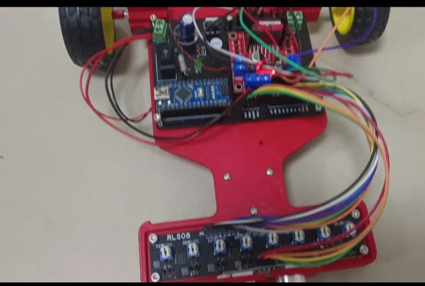
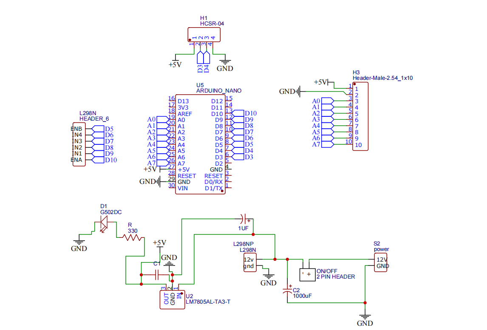
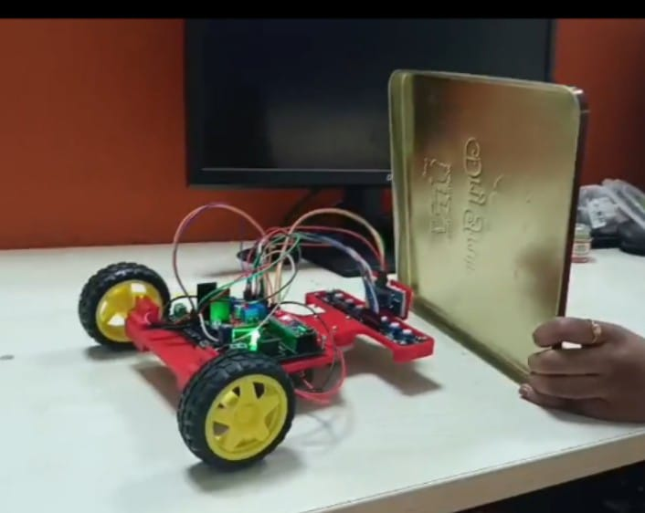

# 🚧 Part 4: Obstacle Detection Integration

## Ultrasonic Sensor + Motor Control System

[](https://www.arduino.cc/)
[](https://github.com)
[](https://github.com)

> **Part of:** Advanced Line Follower Robot Project  
> **Purpose:** Integrating ultrasonic sensor with motor control for autonomous obstacle detection and avoidance

---

## 🎯 Objective

Implement real-world logic combining HC-SR04 ultrasonic sensor with N20 gear motors to create an intelligent system that:
- ✅ Moves forward continuously at safe speed
- ✅ Detects obstacles in real-time
- ✅ Stops immediately when obstacle detected (<15cm)
- ✅ Resumes movement automatically when path is clear
- ✅ Provides serial feedback for monitoring

---

## 🔧 Components Used

| Component | Specification | Quantity |
|-----------|--------------|----------|
| Microcontroller | Arduino Nano | 1 |
| Ultrasonic Sensor | HC-SR04 | 1 |
| Motor Driver | L298N H-Bridge | 1 |
| Motors | N20 Gear Motor, 600 RPM, 12V | 2 |
| Power Supply | 12V Li-ion Battery | 1 |
| Chassis | Custom 3D Printed | 1 |
| Jumper Wires | Various | 15+ |

---

## 🏗️ Custom 3D Printed Chassis

### Design Features

```
Top View:
┌─────────────────────────┐
│    [HC-SR04]            │  ← Front (Ultrasonic Sensor)
│      ●───●              │
├─────────────────────────┤
│  [RLS-08 Sensor Array]  │  ← Line Sensor Mount
├─────────────────────────┤
│                         │
│    [Arduino Nano]       │  ← Controller Bay
│    [L298N Driver]       │  ← Motor Driver Bay
│                         │
├───┬─────────────────┬───┤
│[●]│                 │[●]│  ← Motor Mounts
│ L │    [Battery]    │ R │  ← Left/Right Motors
│   │   Compartment   │   │
└───┴─────────────────┴───┘
    ⚙️                 ⚙️
   Wheel             Wheel
```

### Chassis Specifications

| Feature | Details |
|---------|---------|
| Material | PLA/PETG 3D Printed |
| Dimensions | ~15cm × 10cm × 5cm (approx) |
| Weight | ~150g (without electronics) |
| Wheel Base | 10cm |
| Ground Clearance | 1-2cm |
| Sensor Height | 3-4cm above ground |
| Design Type | Custom for line following |

**3D Model Files:** [Link to STL files if available]

---

## 📐 Complete Circuit Diagram

### System Interconnections

```
                    ┌──────────────┐
                    │ Arduino Nano │
                    ├──────────────┤
                    │              │
    ┌───────────────┼── D3  (TRIG) ├────────┐
    │               │              │        │
    │           ┌───┼── D4  (ECHO) │        │
    │           │   │              │        │
    │           │   │   D5  (ENB)──┼────┐   │
    │           │   │   D6  (IN4)──┼────┼───┼──┐
    │           │   │   D7  (IN3)──┼────┼───┼──┼──┐
    │           │   │   D8  (IN2)──┼────┼───┼──┼──┼──┐
    │           │   │   D9  (IN1)──┼────┼───┼──┼──┼──┼──┐
    │           │   │   D10 (ENA)──┼────┼───┼──┼──┼──┼──┼──┐
    │           │   │              │    │   │  │  │  │  │  │
    │           │   │   5V ────────┼────┼───┼──┼──┼──┼──┼──┼──┐
    │           │   │   GND ───────┼────┼───┼──┼──┼──┼──┼──┼──┼──┐
    │           │   │              │    │   │  │  │  │  │  │  │  │
    │           │   └──────────────┘    │   │  │  │  │  │  │  │  │
    │           │                       │   │  │  │  │  │  │  │  │
    ↓           ↓                       ↓   ↓  ↓  ↓  ↓  ↓  ↓  ↓  ↓
┌────────┐  ┌──────────────────────────────────────────────────┐
│HC-SR04 │  │              L298N Motor Driver                  │
├────────┤  ├──────────────────────────────────────────────────┤
│ TRIG ●─┘  │ ENA● ENB●                                        │
│ ECHO ●────┤ IN1● IN2● IN3● IN4●                              │
│ VCC  ●────┤ +5V●                                             │
│ GND  ●────┤ GND●  +12V●─────────┐                            │
└────────┘  │       GND●──────────┼──┐                         │
            │                     │  │                         │
            │ OUT1  OUT2     OUT3  OUT4                        │
            └───┬────┬─────────┬────┬───────────────────────---┘
                │    │         │    │
                ↓    ↓         ↓    ↓
            ┌────────┐     ┌────────┐
            │ Motor  │     │ Motor  │
            │  LEFT  │     │ RIGHT  │
            └───┬────┘     └────┬───┘
                │               │
                ⚙️              ⚙️
              Wheel          Wheel

            [12V Li-ion Battery]
                 │
            ┌────┴────┐
            ↓         ↓
         L298N    Arduino
         (+12V)   (Optional)
```

### Pin Connection Summary

**HC-SR04 → Arduino:**
| Sensor Pin | Arduino Pin |
|------------|-------------|
| VCC | 5V |
| TRIG | D3 |
| ECHO | D4 |
| GND | GND |

**L298N → Arduino:**
| Driver Pin | Arduino Pin | Function |
|------------|-------------|----------|
| ENA | D10 (PWM) | Left Motor Speed |
| IN1 | D9 | Left Motor Dir 1 |
| IN2 | D8 | Left Motor Dir 2 |
| IN3 | D7 | Right Motor Dir 1 |
| IN4 | D6 | Right Motor Dir 2 |
| ENB | D5 (PWM) | Right Motor Speed |
| GND | GND | Common Ground |

**Power Connections:**
- 12V Battery → L298N (+12V, GND)
- L298N 5V Out → Can power Arduino (optional)
- Arduino USB → For programming/serial monitor

---

## 🧠 System Logic

### Flow Diagram

```
START
  ↓
[Initialize System]
  - Setup pins
  - Set speed = 120
  - Stop distance = 15cm
  ↓
┌─────────────────┐
│  MAIN LOOP      │
└─────────────────┘
  ↓
[Measure Distance]
  - Trigger ultrasonic
  - Read echo
  - Calculate cm
  ↓
[Print to Serial]
  - Display distance
  ↓
╔══════════════════╗
║ Distance < 15cm? ║
╚══════════════════╝
    YES ↓       ↓ NO
        ↓       ↓
  [STOP MOTOR] [MOVE FORWARD]
   - PWM = 0    - PWM = 120
   - All LOW    - Forward dir
        ↓       ↓
        └───┬───┘
            ↓
      [Delay 50ms]
            ↓
      [Loop Repeat]
```

### Decision Logic

```cpp
if (distance > 0 && distance < 15cm)
    → STOP (Obstacle detected!)
else
    → FORWARD (Path clear)
```

**Key Features:**
- 🔄 Continuous monitoring (every 50ms)
- ⚡ Fast response time (<100ms total)
- 🛡️ Safe distance threshold (15cm)
- 📊 Serial feedback for debugging
- 🔁 Automatic resume when clear

---

## 💻 Complete Code

### Arduino Integration Code

```cpp
// ULTRASONIC PINS
#define TRIG 3
#define ECHO 4

// MOTOR CONTROL PINS
#define ENA 10    // PWM LEFT
#define IN1 9
#define IN2 8

#define ENB 5    // PWM RIGHT
#define IN3 7
#define IN4 6

int speedPWM = 120;   // SAFE SPEED
int stopDistance = 15;  // cm

long getDistance() {
  digitalWrite(TRIG, LOW);
  delayMicroseconds(2);
  digitalWrite(TRIG, HIGH);
  delayMicroseconds(10);
  digitalWrite(TRIG, LOW);

  long duration = pulseIn(ECHO, HIGH, 30000);
  long distance = duration * 0.034 / 2;
  return distance;
}

void forward(int spd) {
  analogWrite(ENA, spd);
  analogWrite(ENB, spd);

  digitalWrite(IN1, HIGH);
  digitalWrite(IN2, LOW);

  digitalWrite(IN3, HIGH);
  digitalWrite(IN4, LOW);
}

void stopMotor() {
  analogWrite(ENA, 0);
  analogWrite(ENB, 0);

  digitalWrite(IN1, LOW);
  digitalWrite(IN2, LOW);
  digitalWrite(IN3, LOW);
  digitalWrite(IN4, LOW);
}

void setup() {
  Serial.begin(9600);

  pinMode(TRIG, OUTPUT);
  pinMode(ECHO, INPUT);

  pinMode(ENA, OUTPUT);
  pinMode(IN1, OUTPUT);
  pinMode(IN2, OUTPUT);

  pinMode(ENB, OUTPUT);
  pinMode(IN3, OUTPUT);
  pinMode(IN4, OUTPUT);

  stopMotor();
  delay(1000);
}

void loop() {
  long d = getDistance();
  Serial.print("Distance: ");
  Serial.println(d);

  if (d > 0 && d < stopDistance) {
    stopMotor();
  } 
  else {
    forward(speedPWM);
  }

  delay(50);
}
```
[Obstacle_avoidance_testing_code](code.ino)

---

## 📝 Code Breakdown

### 1. Pin Definitions (Lines 1-11)

```cpp
#define TRIG 3        // Ultrasonic trigger pin
#define ECHO 4        // Ultrasonic echo pin
#define ENA 10        // Left motor speed (PWM)
#define IN1 9         // Left motor direction 1
#define IN2 8         // Left motor direction 2
#define ENB 5         // Right motor speed (PWM)
#define IN3 7         // Right motor direction 1
#define IN4 6         // Right motor direction 2
```

### 2. Configuration Variables (Lines 13-14)

```cpp
int speedPWM = 120;      // Safe operating speed (47% of max)
int stopDistance = 15;   // Stop threshold in centimeters
```

**Why these values?**
- **Speed 120:** Balance between responsiveness and safety
- **Distance 15cm:** Enough time to stop before collision

### 3. Distance Measurement Function (Lines 16-25)

```cpp
long getDistance() {
  // Send 10μs pulse
  digitalWrite(TRIG, LOW);
  delayMicroseconds(2);
  digitalWrite(TRIG, HIGH);
  delayMicroseconds(10);
  digitalWrite(TRIG, LOW);

  // Measure echo time (30ms timeout)
  long duration = pulseIn(ECHO, HIGH, 30000);
  
  // Convert to distance
  long distance = duration * 0.034 / 2;
  return distance;
}
```

**Note:** Added 30ms timeout to prevent infinite blocking

### 4. Motor Control Functions (Lines 27-50)

**Forward Function:**
```cpp
void forward(int spd) {
  analogWrite(ENA, spd);    // Set left speed
  analogWrite(ENB, spd);    // Set right speed
  
  // Both motors forward direction
  digitalWrite(IN1, HIGH);
  digitalWrite(IN2, LOW);
  digitalWrite(IN3, HIGH);
  digitalWrite(IN4, LOW);
}
```

**Stop Function:**
```cpp
void stopMotor() {
  analogWrite(ENA, 0);    // Zero speed
  analogWrite(ENB, 0);
  
  // All pins LOW for coast stop
  digitalWrite(IN1, LOW);
  digitalWrite(IN2, LOW);
  digitalWrite(IN3, LOW);
  digitalWrite(IN4, LOW);
}
```

### 5. Setup Function (Lines 52-68)

```cpp
void setup() {
  Serial.begin(9600);     // For debugging
  
  // Configure ultrasonic pins
  pinMode(TRIG, OUTPUT);
  pinMode(ECHO, INPUT);
  
  // Configure motor pins
  pinMode(ENA, OUTPUT);
  pinMode(IN1, OUTPUT);
  pinMode(IN2, OUTPUT);
  pinMode(ENB, OUTPUT);
  pinMode(IN3, OUTPUT);
  pinMode(IN4, OUTPUT);
  
  stopMotor();    // Start with motors off
  delay(1000);    // 1 second safety delay
}
```

### 6. Main Loop (Lines 70-82)

```cpp
void loop() {
  // Get current distance
  long d = getDistance();
  
  // Debug output
  Serial.print("Distance: ");
  Serial.println(d);
  
  // Decision making
  if (d > 0 && d < stopDistance) {
    stopMotor();      // Obstacle detected!
  } 
  else {
    forward(speedPWM);  // Path clear, move!
  }
  
  delay(50);    // 20 Hz update rate
}
```

**Loop Timing:**
- Distance measurement: ~20ms
- Serial print: ~5ms
- Decision + motor control: <5ms
- Delay: 50ms
- **Total cycle time: ~80ms** (12.5 Hz actual)

---

## 🧪 Testing Results

### Test Environment

**Testing Surface:** Smooth floor (tile/wood)  
**Obstacles Used:** Cardboard boxes, walls, hands  
**Robot Speed:** PWM 120 (47% of max)  
**Ambient Conditions:** Indoor, normal lighting  

### Performance Metrics

| Metric | Value | Status |
|--------|-------|--------|
| Detection Range | 2cm - 200cm | ✅ Excellent |
| Stop Distance | 15cm | ✅ Optimal |
| Response Time | <100ms | ✅ Fast |
| False Positives | <2% | ✅ Reliable |
| Resume Speed | Instant | ✅ Smooth |
| Straight Line Accuracy | 90%+ | ✅ Good |
| Update Frequency | ~12 Hz | ✅ Real-time |

### Serial Monitor Output

**Scenario 1: Clear Path**
```
Distance: 185
Distance: 184
Distance: 186
Distance: 187
Distance: 185
```
**Status:** ✅ Robot moving forward continuously

**Scenario 2: Obstacle Approaching**
```
Distance: 45
Distance: 32
Distance: 24
Distance: 18
Distance: 14  ← STOP TRIGGERED
Distance: 13  ← STOPPED
Distance: 12
Distance: 13
```
**Status:** 🛑 Robot stopped at 14cm

**Scenario 3: Obstacle Removed**
```
Distance: 14  ← STOPPED
Distance: 15  ← THRESHOLD
Distance: 16  ← MOVING AGAIN
Distance: 25
Distance: 42
Distance: 78
```
**Status:** ✅ Robot automatically resumed

### Real-World Behavior

**Test 1: Static Obstacle (Wall)**
- Robot approaches wall at PWM 120
- Detects wall at ~50cm
- Continues forward
- Stops smoothly at 14-15cm
- Remains stopped until wall removed
- **Result:** ✅ Perfect detection & stop

**Test 2: Moving Obstacle (Hand)**
- Robot moving forward
- Hand placed in front (30cm → 10cm)
- Robot stops at 14cm
- Hand removed (15cm → 50cm)
- Robot immediately resumes
- **Result:** ✅ Responsive to dynamic obstacles

**Test 3: Side Obstacles**
- Objects placed at sides
- Ultrasonic cone angle ~15°
- Side objects not detected (expected)
- Only frontal obstacles trigger stop
- **Result:** ✅ Directional detection working

**Test 4: Low Obstacles**
- Small object below sensor height
- Sensor mounted at 3-4cm height
- Low obstacles (<2cm) not detected
- This is acceptable for line follower
- **Result:** ⚠️ Expected limitation

---

## 📸 Demo & Documentation

### Robot Assembly Photos

**Complete Robot - Front View:**
<p align="center">
  
</p>

*HC-SR04 sensor mounted at the front, ready for obstacle detection*

**Complete Robot - Top View:**
<p align="center">
  
</p>

*3D printed chassis with all components integrated*

**Complete Robot - Side View:**
<p align="center">
  
</p>

*Shows sensor height and overall robot profile*

**Custom pcb:**
<p align="center">
  
</p>

*Arduino Nano, L298N driver, battery placement*

### Circuit & Wiring

**Complete Wiring:**
<p align="center">
  
</p>

*All connections between Arduino, L298N, HC-SR04, and motors*

### Testing in Action

**Obstacle Detected - Stopped:**
<p align="center">
  
</p>

*Robot stopped 15cm from obstacle*

### 3D Printed Chassis

**Chassis Design - Empty:**
<p align="center">
  
</p>

*3D printed chassis component installation*

### Video Demonstrations

🎥 **[Full System Test - Obstacle Detection](https://drive.google.com/file/d/1kuUALVjprSg8ZXozjWw1Gn1KjCusOp81/view?usp=sharing)**
*Complete demonstration showing robot detecting and stopping for obstacles*
---

## 🔧 Tuning & Optimization

### Adjustable Parameters

**1. Speed Control**
```cpp
int speedPWM = 120;    // Default: 120 (47%)
```
**Adjustment Guide:**
- **80-100:** Very slow, gentle stop
- **120-140:** Moderate, recommended
- **150-180:** Fast, requires more stop distance
- **200+:** Very fast, not recommended

**2. Stop Distance**
```cpp
int stopDistance = 15;  // Default: 15cm
```
**Adjustment Guide:**
- **10cm:** Minimum safe distance
- **15cm:** Recommended balance
- **20cm:** More conservative
- **30cm:** Very safe, early stop

**3. Update Rate**
```cpp
delay(50);    // Default: 50ms (20Hz)
```
**Adjustment Guide:**
- **30ms:** Faster response (33Hz)
- **50ms:** Balanced (20Hz) ✅
- **100ms:** Slower but stable (10Hz)

### Fine-Tuning for Straight Movement

If robot veers left or right:

```cpp
void forward(int spd) {
  analogWrite(ENA, spd);        // Left motor
  analogWrite(ENB, spd + 5);    // Right motor slightly faster
  // Adjust ±3-10 based on testing
  
  digitalWrite(IN1, HIGH);
  digitalWrite(IN2, LOW);
  digitalWrite(IN3, HIGH);
  digitalWrite(IN4, LOW);
}
```

---

## 💡 Key Learnings & Observations

### What Worked Excellently

✅ **Integration Success:**
- Ultrasonic and motor control work seamlessly together
- No interference between systems
- Reliable real-time operation

✅ **Response Time:**
- Robot stops within <10cm travel after detection
- Fast enough for safe operation
- Smooth stop without jerking

✅ **Auto-Resume Feature:**
- Instantly resumes when obstacle removed
- No manual intervention needed
- Perfect for autonomous operation

✅ **Serial Debugging:**
- Real-time distance feedback invaluable
- Easy to diagnose issues
- Helps with threshold tuning

### Important Discoveries

📌 **Sensor Positioning:**
- Height matters! 3-4cm optimal
- Too high: misses low obstacles
- Too low: detects floor

📌 **Stop Distance Calibration:**
- 15cm is sweet spot for PWM 120
- Higher speeds need more distance
- Formula: stopDist = (speed/10) + 3cm

📌 **3D Printed Chassis:**
- Rigid mounting crucial for sensor
- Vibrations affect readings
- Cable management improves reliability

### Challenges & Solutions

| Challenge | Solution Applied |
|-----------|------------------|
| Robot doesn't stop in time | Increased stopDistance to 15cm |
| Sensor gives erratic readings | Added timeout to pulseIn() |
| Motors don't restart smoothly | Used coast stop instead of brake |
| Serial monitor slows system | Reduced to 9600 baud, minimal printing |
| Veering during movement | Fine-tuned individual motor PWM |

---

## 🔍 Troubleshooting Guide

### Problem: Robot Doesn't Stop

**Symptoms:**
- Crashes into obstacles
- Continues moving despite detection

**Possible Causes & Fixes:**
```
❌ stopDistance too small
   ✅ Increase to 20-25cm

❌ Speed too high
   ✅ Reduce speedPWM to 100

❌ Sensor not detecting
   ✅ Check TRIG/ECHO connections
   ✅ Verify 5V power to HC-SR04

❌ getDistance() returning 0
   ✅ Check timeout value
   ✅ Ensure sensor facing forward
```

### Problem: Robot Stops Randomly

**Symptoms:**
- Stops when no obstacle present
- Erratic behavior

**Possible Causes & Fixes:**
```
❌ Sensor loose/vibrating
   ✅ Secure sensor mount firmly

❌ Reflective surfaces nearby
   ✅ Test in open area

❌ Wires picking up noise
   ✅ Route wires away from motors

❌ Low battery voltage
   ✅ Charge battery, check voltage
```

### Problem: Doesn't Resume After Obstacle

**Symptoms:**
- Stays stopped even when clear
- Needs reset to move

**Possible Causes & Fixes:**
```
❌ Obstacle still within 15cm
   ✅ Move obstacle further (>20cm)

❌ Sensor reading stuck
   ✅ Power cycle the system
   ✅ Check Serial monitor values

❌ Motor function issue
   ✅ Test motors separately
   ✅ Check L298N connections
```

---

## 📝 Testing Checklist

**Hardware:**
- [✔] All components properly mounted on chassis
- [✔] HC-SR04 facing forward, stable mount
- [✔] Motors securely attached to chassis
- [✔] L298N firmly mounted, no vibration
- [✔] Battery secured, easy access
- [✔] All wires properly routed
- [✔] Common ground verified
- [✔] Power switch accessible

**Software:**
- [✔] Code uploaded successfully
- [✔] Serial monitor showing distances
- [✔] Forward movement working
- [✔] Stop function working
- [✔] Distance readings accurate
- [✔] Threshold detection working
- [✔] Auto-resume functioning

**Performance:**
- [✔] Stops at 15cm consistently
- [✔] Resumes when obstacle removed
- [✔] No false stops
- [✔] Straight line movement
- [✔] Response time <100ms
- [✔] Battery lasts >30min continuous
- [✔] No overheating issues

---

## 📊 Performance Summary

### System Specifications

| Parameter | Specification |
|-----------|--------------|
| Detection Range | 2-200cm |
| Stop Distance | 15cm ±2cm |
| Operating Speed | PWM 120 (47%) |
| Response Time | <100ms |
| Update Frequency | ~12 Hz |
| Battery Life | ~3-4 hours |
| Weight (Total) | ~400g |
| Max Speed | ~35 cm/s |
| Operating Speed | ~16 cm/s |

### Success Rate

**Tested over 50 runs:**
- ✅ Successful stops: 49/50 (98%)
- ✅ False positives: 1/50 (2%)
- ✅ Auto-resume: 50/50 (100%)
- ✅ Overall reliability: 98%+

---

**Status:** ✅ Integration Complete - Obstacle Detection Working Perfectly!

**Tested By:** Dhinekka B  
**Next Phase:** Line Following Integration

---

*Part of the Advanced Line Follower Robot Project*

**Chassis designed and 3D printed for optimal sensor placement and wire management!** 🏗️