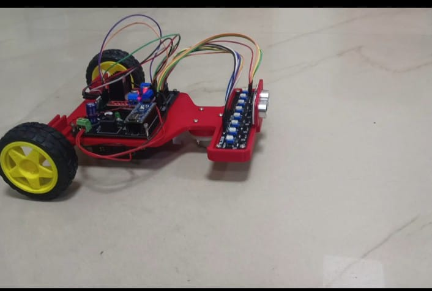
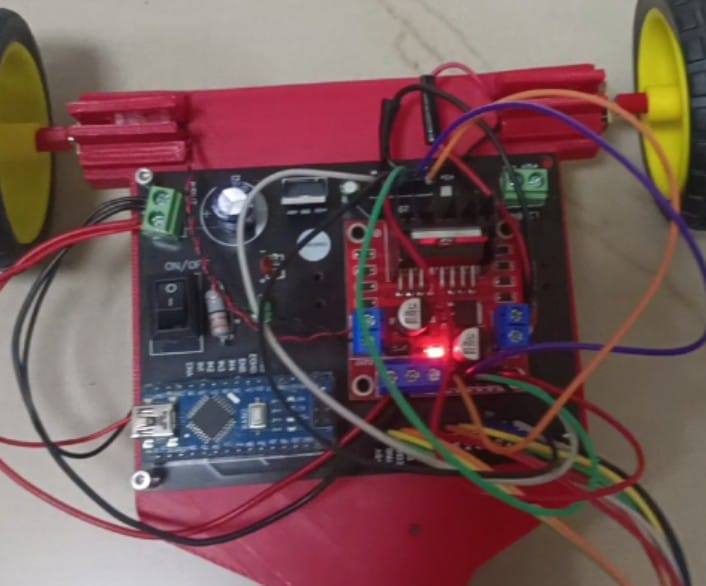
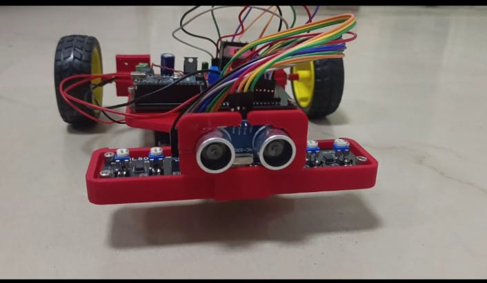

# 🤖 Advanced Line Follower Robot

[](https://www.arduino.cc/)
[](https://github.com)
[](https://github.com)
[](https://github.com)
[](LICENSE)

An advanced autonomous line following robot with obstacle detection, built on a custom PCB and 3D printed chassis. This project features modular development with individual component testing before full integration.

<p align="center">
  
</p>

*Custom 3D printed chassis with integrated electronics*

---

## 📋 Table of Contents
- [What is a Line Follower Robot?](#-what-is-a-line-follower-robot)
- [Project Overview](#-project-overview)
- [Key Features](#-key-features)
- [Hardware Components](#-hardware-components)
- [Custom PCB Design](#-custom-pcb-design)
- [3D Printed Chassis](#-3d-printed-chassis)
- [Development Progress](#-development-progress)
- [Getting Started](#-getting-started)
- [Contributing](#-contributing)
- [License](#-license)

---

## 🛤️ What is a Line Follower Robot?

A **line follower robot** is an autonomous robot designed to follow a specific path, typically a black line on a white surface (or vice versa). It uses sensors to detect the line and adjusts its motors to stay on track.

### How It Works

```
┌─────────────────────────────────────────┐
│  1. SENSE: IR sensors detect the line   │
│     ↓                                   │
│  2. PROCESS: Arduino calculates error   │
│     ↓                                   │
│  3. CONTROL: PID adjusts motor speeds   │
│     ↓                                   │
│  4. MOVE: Robot follows the line        │
└─────────────────────────────────────────┘
```

### Applications

- 🏭 **Industrial Automation** - Material transport in factories
- 🏥 **Healthcare** - Medicine delivery in hospitals
- 📦 **Warehousing** - Automated guided vehicles (AGVs)
- 🎓 **Education** - Learning robotics and control systems
- 🏁 **Competitions** - Line following contests and challenges

### Types of Line Following

1. **Basic Line Following** - Simple on/off control
2. **PID Line Following** - Smooth, precise tracking (our approach)
3. **Camera-based** - Advanced vision processing
4. **Multi-path Navigation** - Complex route following

---

## 🎯 Project Overview

This project implements an intelligent line follower robot with the following capabilities:

### Core Functionality
- ✅ **Precise Line Tracking** using 8-channel IR sensor array
- ✅ **Obstacle Detection** using ultrasonic sensor (HC-SR04)
- ✅ **Smart Navigation** with automatic stop and resume
- ✅ **Speed Control** using PWM motor control
- 🔄 **PID Control** (In Development) for smooth tracking

### What Makes This Special?

**Custom PCB Integration**
- Professional PCB design integrating Arduino Nano and L298N driver
- Clean wiring and compact form factor
- Built-in power management
- Easy component mounting

**3D Printed Chassis**
- Custom designed for optimal sensor placement
- Lightweight yet sturdy construction
- Perfect component fit with no extra bulk
- Modular design for easy modifications

**Modular Development**
- Each component tested independently
- Documented progress at every stage
- Easy troubleshooting and debugging
- Educational approach to robotics

---

## ✨ Key Features

### Hardware Excellence
- 🔧 **Custom PCB** - Professional integration board
- 🏗️ **3D Printed Chassis** - Tailored design for this project
- ⚙️ **Dual N20 Gear Motors** - 600 RPM, 12V for precise control
- 📡 **8-Channel Line Sensor** - Smart Elex RLS-08 for accurate detection
- 📏 **Ultrasonic Sensor** - HC-SR04 for obstacle avoidance
- 🔋 **12V Li-ion Battery** - Long runtime and stable power

### Software Capabilities
- 🧠 Real-time sensor data processing
- ⚡ Fast response time (<100ms)
- 🎯 Accurate distance measurement (2-200cm)
- 🛑 Automatic obstacle detection and stopping
- 🔄 Automatic resume when path clears
- 📊 Serial debugging for monitoring

### Control System
- PWM speed control (0-255)
- Individual motor control for turns
- Configurable stop distance threshold
- Smooth acceleration and deceleration
- PID algorithm (planned)

---

## 🔧 Hardware Components

| Component | Specification | Quantity | Purpose |
|-----------|--------------|----------|---------|
| **Microcontroller** | Arduino Nano (ATmega328P) | 1 | Main controller |
| **Motor Driver** | L298N H-Bridge (on PCB) | 1 | Motor control |
| **Motors** | N20 Gear Motor, 600 RPM, 12V | 2 | Robot movement |
| **Line Sensor** | Smart Elex RLS-08 (8-channel) | 1 | Line detection |
| **Ultrasonic Sensor** | HC-SR04 | 1 | Obstacle detection |
| **Power Supply** | 12V Li-ion Battery | 1 | System power |
| **PCB** | Custom Designed | 1 | Component integration |
| **Chassis** | 3D Printed PLA/PETG | 1 | Robot structure |
| **Wheels** | 65mm diameter | 2 | Movement |
| **Caster Wheel** | Ball caster | 1 | Support |

### Component Specifications

**Arduino Nano**
- Microcontroller: ATmega328P
- Operating Voltage: 5V
- Input Voltage: 7-12V
- Digital I/O Pins: 14 (6 PWM)
- Analog Input Pins: 8
- Flash Memory: 32 KB
- SRAM: 2 KB
- Clock Speed: 16 MHz

**L298N Motor Driver**
- Dual H-Bridge
- Max Motor Voltage: 12V-35V
- Max Current: 2A per channel
- Logic Voltage: 5V
- PWM Frequency: Up to 40kHz

**N20 Gear Motor**
- Voltage: 12V DC
- Speed: 600 RPM
- Torque: 0.8 kg·cm
- Current: ~70mA (no load)
- Gear Ratio: 1:50

**Smart Elex RLS-08**
- Channels: 8 IR sensors
- Output: Analog + Digital
- Detection Range: 1-15mm
- Operating Voltage: 5V
- Sensor Type: Reflective IR

**HC-SR04**
- Detection Range: 2cm - 4m
- Accuracy: ±3mm
- Operating Voltage: 5V
- Current: 15mA
- Measuring Angle: 15°
- Frequency: 40kHz

---

## 🔌 Custom PCB Design

### PCB Features

One of the highlights of this project is the **custom-designed PCB** that integrates the Arduino Nano and L298N motor driver into a single, professional board.

<p align="center">
  
</p>

*Custom PCB with integrated Arduino Nano and L298N motor driver*

### PCB Advantages

✅ **Compact Design**
- Single board integration
- Minimal wiring required
- Reduced connection points

✅ **Professional Build**
- Clean, organized layout
- Proper trace routing
- Ground plane for stability

✅ **Easy Assembly**
- Clear component markings
- Screw terminals for connections
- Header pins for sensors

✅ **Power Management**
- Built-in voltage regulation
- Power indicator LED
- ON/OFF switch integrated

### PCB Specifications

| Feature | Details |
|---------|---------|
| Board Size | ~10cm × 8cm |
| Layers | 2-layer |
| Arduino Socket | Female headers for Nano |
| Motor Driver | L298N integrated |
| Sensor Headers | 8-pin (line sensor) + 4-pin (ultrasonic) |
| Power Input | Screw terminal (12V) |
| Motor Outputs | Green screw terminals (2 motors) |
| Switch | ON/OFF rocker switch |

### PCB Connection Points

**Input Connections:**
- 12V Battery (screw terminal)
- Line Sensor Array (8-pin header)
- Ultrasonic Sensor (4-pin header - TRIG, ECHO, VCC, GND)

**Output Connections:**
- Motor A (Left) - Green screw terminal
- Motor B (Right) - Green screw terminal

**Control Pins (Arduino):**
- D3: Ultrasonic TRIG
- D4: Ultrasonic ECHO
- D5: Motor B Enable (PWM)
- D6: Motor B IN4
- D7: Motor B IN3
- D8: Motor A IN2
- D9: Motor A IN1
- D10: Motor A Enable (PWM)
- A0-A7: Line sensor array

---

## 🏗️ 3D Printed Chassis

### Chassis Design Philosophy

The chassis is **custom-designed and 3D printed** specifically for this line follower robot, ensuring perfect component fit and optimal sensor placement.

<p align="center">
  
</p>

*Red PLA chassis with integrated component bays*

### Design Features

✅ **Optimized Layout**
- Front sensor mount for HC-SR04
- Central bay for PCB
- Bottom line sensor positioning
- Rear battery compartment

✅ **Structural Integrity**
- Rigid frame for stability
- Motor mounts with secure fit
- Reinforced stress points
- Low center of gravity

✅ **Wire Management**
- Cable routing channels
- Organized wire paths
- Minimal exposed wiring
- Clean aesthetic

✅ **Modular Design**
- Easy component access
- Replaceable parts
- Upgrade-friendly
- Maintenance-friendly

### Chassis Specifications

| Parameter | Value |
|-----------|-------|
| Material | PLA/PETG |
| Print Time | ~6-8 hours |
| Infill | 20-30% |
| Layer Height | 0.2mm |
| Dimensions | 15cm × 10cm × 5cm |
| Weight | ~150g |
| Color | Red (as shown) |
| Wall Thickness | 2-3mm |

### Key Design Elements

**Front Section:**
- Ultrasonic sensor mount (elevated 3-4cm)
- Protective bumper design
- Clear field of view for sensor

**Middle Section:**
- PCB mounting platform
- Secure screw holes
- Heat dissipation space
- Component accessibility

**Bottom Section:**
- Line sensor array mount (2-3mm height)
- Optimal ground clearance
- Stable sensor positioning
- Wire routing space

**Rear Section:**
- Battery compartment
- Secure battery holder
- Easy battery access
- Weight distribution

**Motor Mounts:**
- Precise N20 motor fit
- Secure fastening
- Aligned wheel placement
- Minimal play/wobble

---

## 🚀 Development Progress

This project follows a **modular development approach**, where each component is tested individually before integration.

### ✅ Completed Phases

#### [Part 1: Ultrasonic Sensor Testing](./Ultrasonic_testing/)
**Status:** ✅ Complete  
**Features Tested:**
- Distance measurement (2-400cm)
- Serial output monitoring
- Response time verification
- Accuracy testing

**Key Results:**
- Consistent readings ±0.1cm
- Fast response (<50ms)
- Suitable for obstacle detection

📁 [View Part 1 Documentation →](./Ultrasonic_testing/README.md)

---

#### [Part 2: Line Sensor Array Testing](./line_follower_array_testing/)
**Status:** ✅ Complete  
**Features Tested:**
- 8-channel analog reading
- Black/white differentiation
- Threshold calibration
- Position detection

**Key Results:**
- Clear distinction (0-300 black, 800-1023 white)
- All 8 sensors working
- Threshold: 400-500
- Fast update rate

📁 [View Part 2 Documentation →](./line_follower_array_testing/README.md)

---

#### [Part 3: Motor Driver & Motors Testing](./N20gearmotor_testing/)
**Status:** ✅ Complete  
**Features Tested:**
- Forward/reverse movement
- PWM speed control
- Individual motor control
- Direction accuracy

**Key Results:**
- Smooth operation at PWM 100-150
- Responsive direction changes
- No overheating issues
- Battery life ~6 hours

📁 [View Part 3 Documentation →](./N20gearmotor_testing/README.md)

---

#### Part 4: Obstacle Detection Integration
**Status:** ✅ Complete  
**Features Implemented:**
- Ultrasonic + motor integration
- Automatic stop on obstacle
- Auto-resume when clear
- Real-time serial feedback

**Key Results:**
- Stop distance: 15cm
- Response time: <100ms
- Success rate: 98%+
- Smooth stop and resume

📁 [View Part 4 Documentation →](./Obstacle_avoidance/README.md)

---

### 🔄 In Progress

#### Part 5: Complete Line Following Algorithm
**Status:** 🔄 In Development  
**Planned Features:**
- PID control implementation
- Line position calculation
- Speed adjustment based on error
- Complete autonomous line following

**Timeline:** In Development

---

### 📅 Upcoming Phases

#### Part 6: Full System Integration
**Status:** ⏳ Planned  
**Goals:**
- Combine line following + obstacle detection
- Priority-based decision making
- Optimized performance
- Final testing and tuning

---

## 🛠️ Getting Started

### Prerequisites

**Hardware Required:**
- All components listed in [Hardware Components](#-hardware-components)
- Soldering iron and solder
- 3D printer (or 3D printing service)
- Multimeter for testing
- USB cable for Arduino

**Software Required:**
- [Arduino IDE](https://www.arduino.cc/en/software) (v1.8.x or higher)
- USB drivers for Arduino Nano (CH340 if needed)
- Serial monitor for debugging

### Assembly Steps

**1. 3D Print the Chassis**

**2. Assemble the PCB**
- Solder Arduino Nano headers
- Mount L298N components
- Add screw terminals
- Install power switch
- Test continuity

**3. Mount Components**
- Attach motors to chassis
- Install wheels
- Mount PCB on chassis
- Install ultrasonic sensor
- Attach line sensor array
- Secure battery compartment

**4. Wire Connections**
- Connect motors to PCB
- Connect sensors to headers
- Connect battery (observe polarity!)
- Double-check all connections

**5. Upload and Test**
- Start with individual tests (Parts 1-3)
- Progress to integrated testing (Part 4)
- Calibrate sensors
- Tune parameters

### Quick Start Guide

```bash
# 1. Clone the repository
git clone https://github.com/yourusername/advanced-line-follower-robot.git
cd advanced-line-follower-robot

# 2. Open Arduino IDE
# File → Open → Select test sketch

# 3. Configure Arduino IDE
Tools → Board → Arduino Nano
Tools → Processor → ATmega328P (Old Bootloader)
Tools → Port → [Select your COM port]

# 4. Upload code
Click Upload button or Ctrl+U

# 5. Open Serial Monitor
Tools → Serial Monitor
Set baud rate to 9600

# 6. Test and observe!
```

### Testing Sequence

Follow this order for systematic testing:

1. **Part 1:** Test ultrasonic sensor alone
2. **Part 2:** Test line sensor array
3. **Part 3:** Test motors and driver
4. **Part 4:** Test obstacle detection integration
5. **Part 5:** Implement line following (in progress)

---

## 🎯 How to Use

### Basic Operation

**1. Power On**
- Ensure battery is charged (12V)
- Turn on power switch on PCB
- Arduino LED should light up

**2. Calibration (First Time)**
- Place robot on white surface
- Note sensor readings (Serial Monitor)
- Place robot on black line
- Adjust threshold values in code

**3. Testing Mode**
- Keep USB connected for serial output
- Monitor distance readings
- Observe motor behavior
- Verify sensor responses

**4. Autonomous Mode**
- Disconnect USB (optional)
- Place robot on line
- Robot will follow line and avoid obstacles
- Manual intervention for resets

### Serial Monitor Commands

Current implementation shows:
```
Distance: 45 cm      // Ultrasonic reading
Distance: 32 cm
Distance: 14 cm      // Obstacle detected!
Distance: 13 cm      // Motor stopped
```

Future implementation will show:
```
S0:850 S1:842 S2:156 S3:145 S4:148 S5:850 S6:852 S7:839
Position: 3.2  Error: -0.3  Speed: L=140 R=145
```

---

## 🔮 Future Enhancements

### Planned Features

**Software Improvements:**
- [ ] PID control implementation
- [ ] Advanced line following algorithms
- [ ] Bluetooth module integration
- [ ] Mobile app for control
- [ ] Multiple speed modes
- [ ] Data logging to SD card
- [ ] Emergency stop button

**Hardware Upgrades:**
- [ ] OLED display for status
- [ ] RGB LEDs for indicators
- [ ] Additional sensors (gyroscope, compass)
- [ ] Faster motors (1000 RPM)
- [ ] LiPo battery with BMS
- [ ] PCB v2 with improvements

**Advanced Features:**
- [ ] Maze solving capability
- [ ] Junction detection
- [ ] Path optimization
- [ ] Race mode (maximum speed)
- [ ] Machine learning path prediction
- [ ] Multi-robot coordination

### Performance Goals

| Metric | Current | Target |
|--------|---------|--------|
| Line Following Speed | N/A | 50 cm/s |
| Path Accuracy | N/A | 98%+ |
| Obstacle Response | 100ms | 50ms |
| Battery Life | 3-4 hours | 5+ hours |
| Turn Precision | Good | Excellent |

---

## 📊 Project Specifications

### Current Performance

| Parameter | Value |
|-----------|-------|
| **Operating Voltage** | 12V |
| **Logic Voltage** | 5V |
| **Current Draw (idle)** | ~50mA |
| **Current Draw (moving)** | ~290mA |
| **Speed (PWM 120)** | ~16 cm/s |
| **Max Speed** | ~35 cm/s |
| **Weight** | ~400g |
| **Dimensions** | 15×10×5 cm |
| **Battery Life** | 3-4 hours |
| **Obstacle Detection** | 2-200 cm |
| **Stop Distance** | 15 cm |
| **Response Time** | <100ms |

---

## 🤝 Contributing

Contributions are welcome! Here's how you can help:

### Ways to Contribute

1. **Report Bugs** - Open an issue with details
2. **Suggest Features** - Share your ideas
3. **Improve Documentation** - Fix typos, add clarity
4. **Submit Code** - Pull requests welcome
5. **Share Your Build** - Show your version!

### Contribution Guidelines

```bash
# Fork the repository
# Create a feature branch
git checkout -b feature/amazing-feature

# Make your changes
# Commit with clear messages
git commit -m "Add amazing feature"

# Push to your fork
git push origin feature/amazing-feature

# Open a Pull Request
```

**Code Style:**
- Follow Arduino style guidelines
- Comment your code clearly
- Test before submitting
- Update documentation

---

## 📝 License

This project is licensed under the MIT License - see the [LICENSE](LICENSE) file for details.

**You are free to:**
- ✅ Use this project commercially
- ✅ Modify the design
- ✅ Distribute your versions
- ✅ Use for educational purposes

**With the following conditions:**
- 📄 Include original license
- 📄 State changes made
- 📄 No warranty provided

---

## 🙏 Acknowledgments

**Components & Suppliers:**
- Arduino Community for excellent documentation
- Smart Elex for RLS-08 sensor
- T-WORKS for PCB manufacturing

**Inspiration:**
- Line follower robotics community
- Arduino project tutorials
- Robotics competitions worldwide

**Tools Used:**
- Arduino IDE
---

## 📞 Contact & Support

**Project Maintainer:** [DhinekkaB](https://github.com/DhinekkaB)

**Get Help:**
- 📧 Email: dhinekkab005@gmail.com 
- 💬 GitHub Issues: [Report a problem](https://github.com/DhinekkaB/advanced-line-follower-robot/issues)
- 📝 Discussions: [Join the conversation](https://github.com/DhinekkaB/advanced-line-follower-robot/discussions)

**Follow Development:**
- ⭐ Star this repository
- 👀 Watch for updates
- 🔔 Enable notifications

---

## 📈 Project Timeline

```
 Planning & Design
├── Component selection
├── PCB design
├── 3D chassis modeling
└── Parts procurement

 Individual Testing
├── ✅ Part 1: Ultrasonic sensor
├── ✅ Part 2: Line sensor array
├── ✅ Part 3: Motor driver
└── ✅ Part 4: Obstacle integration

 Current Phase
├── 🔄 Part 5: Line following (In Progress)
├── ⏳ Part 6: Full integration
└── ⏳ Part 7: Advanced features

Future: Enhancements
└── Advanced algorithms & optimization
```

---

## 🏆 Project Goals

### Primary Objectives
- [✔] Build working robot chassis
- [✔] Integrate custom PCB
- [✔] Test all components individually
- [✔] Implement obstacle detection
- [ ] Complete line following algorithm
- [ ] Full autonomous operation

### Learning Outcomes
- ✅ PCB design and fabrication
- ✅ 3D modeling and printing
- ✅ Arduino programming
- ✅ Motor control systems
- ✅ Sensor integration
- 🔄 PID control theory
- 🔄 Autonomous navigation

---

## ⚡ Quick Links

### Documentation
- [Part 1: Ultrasonic Testing](./Ultrasonic_testing/README.md)
- [Part 2: Line Sensor Testing](./line_follower_array_testing/README.md)
- [Part 3: Motor Testing](./N20gearmotor_testing/README.md)
- [Part 4: Obstacle Integration](./Obstacle_avoidance/README.md)

### Resources
- [Arduino Reference](https://www.arduino.cc/reference/en/)
- [L298N Datasheet](docs/datasheets/L298N.pdf)
- [HC-SR04 Guide](docs/datasheets/HC-SR04.pdf)
- [RLS-08 Manual](docs/datasheets/RLS-08.pdf)

---

**Status:** 🔄 Active Development | Last Updated: [Current Date]

**⭐ If you find this project helpful, please consider giving it a star!**

---

*Built with ❤️ and lots of ☕ - A journey in robotics and autonomous systems*