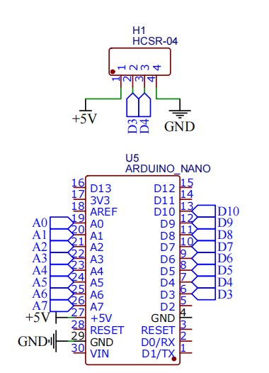
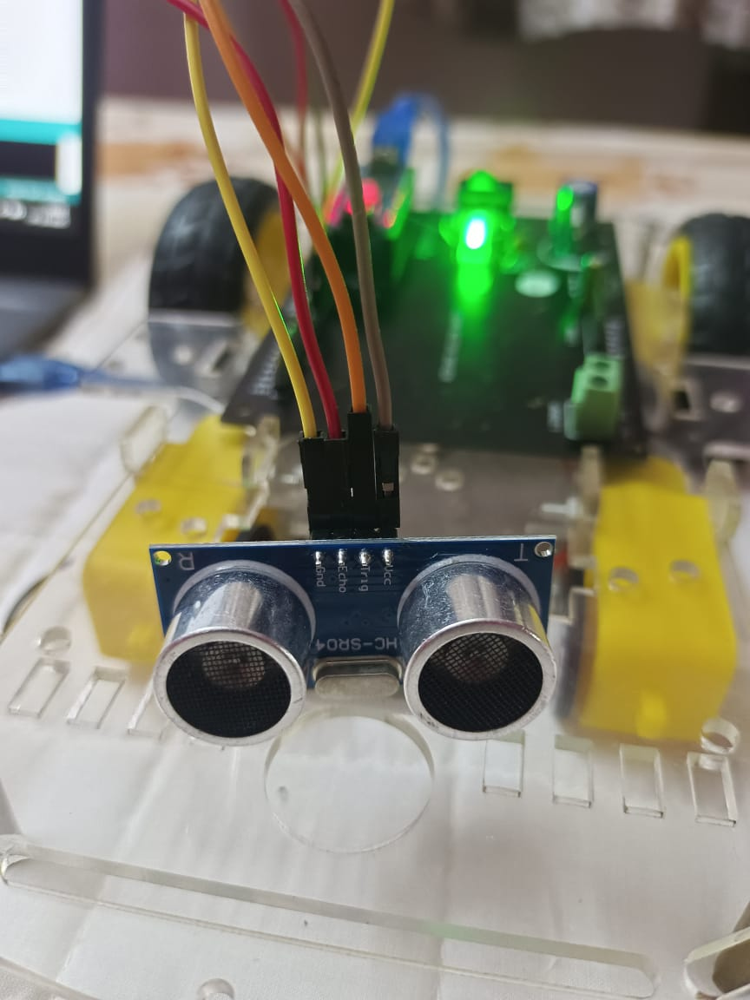
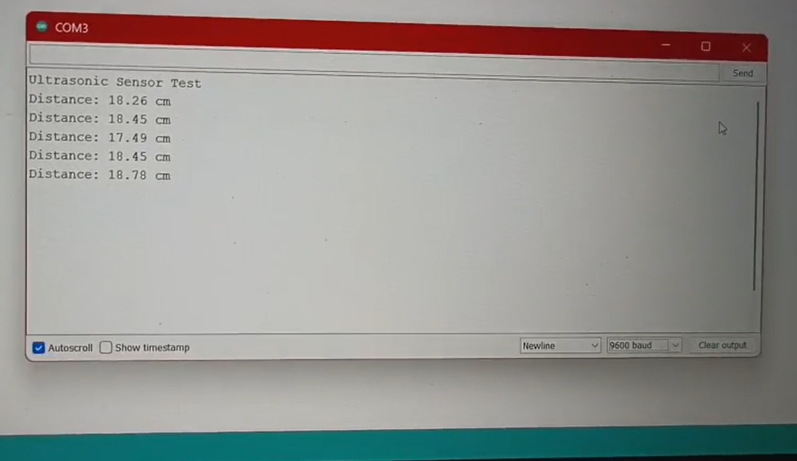

# 📡 Ultrasonic Sensor Testing

## HC-SR04 Distance Measurement & Obstacle Detection

[](https://www.arduino.cc/)
[](https://github.com)
[](https://github.com)

> **Part of:** Advanced Line Follower Robot Project  
> **Purpose:** Testing obstacle detection capability using ultrasonic sensor

---

## 🎯 Objective

Test the HC-SR04 ultrasonic sensor for accurate distance measurement, which will be used for obstacle detection in the final line follower robot.

---

## 🔧 Components Used

| Component | Model | Quantity |
|-----------|-------|----------|
| Microcontroller | Arduino Nano | 1 |
| Ultrasonic Sensor | HC-SR04 | 1 |
| Custom PCB | Standard | 1 |
| Jumper Wires | Male-to-Male | 4 |
| USB Cable | Mini USB | 1 |

---

## 📐 Circuit Diagram

### Pin Connections

```
┌─────────────┐              ┌──────────────┐
│  HC-SR04    │              │ Arduino Nano │
├─────────────┤              ├──────────────┤
│             │              │              │
│  VCC     ───┼──────────────┼───  5V       │
│  TRIG    ───┼──────────────┼───  D3       │
│  ECHO    ───┼──────────────┼───  D4       │
│  GND     ───┼──────────────┼───  GND      │
│             │              │              │
└─────────────┘              └──────────────┘
```

### Connection Table

| HC-SR04 Pin | Arduino Nano Pin |
|-------------|------------------|
| VCC | 5V |
| TRIG | Digital Pin 3 |
| ECHO | Digital Pin 4 |
| GND | GND |

---

## ⚙️ How It Works

### Working Principle

1. **Trigger Signal** → Arduino sends a 10µs HIGH pulse to TRIG pin
2. **Ultrasonic Burst** → Sensor emits 8 ultrasonic pulses at 40kHz
3. **Echo Reception** → Sound waves bounce back from obstacle
4. **Time Measurement** → ECHO pin stays HIGH for duration of travel time
5. **Distance Calculation** → Distance = (Time × Speed of Sound) / 2

### Formula

```
Distance (cm) = (Duration in microseconds × 0.0343) / 2

Where:
- 0.0343 cm/µs = Speed of sound in air at room temperature
- Division by 2 = Sound travels to object and back
```

---

## 💻 Code

### Arduino Code

```cpp
#define TRIG_PIN 3
#define ECHO_PIN 4

void setup() {
  Serial.begin(9600);
  pinMode(TRIG_PIN, OUTPUT);
  pinMode(ECHO_PIN, INPUT);
  Serial.println("Ultrasonic Sensor Test");
}

void loop() {
  long duration;
  float distance;

  // Send 10µs pulse to trigger pin
  digitalWrite(TRIG_PIN, LOW);
  delayMicroseconds(2);
  digitalWrite(TRIG_PIN, HIGH);
  delayMicroseconds(10);
  digitalWrite(TRIG_PIN, LOW);

  // Measure echo time
  duration = pulseIn(ECHO_PIN, HIGH);

  // Convert time to distance (in cm)
  distance = duration * 0.0343 / 2;

  // Print result
  Serial.print("Distance: ");
  Serial.print(distance);
  Serial.println(" cm");

  delay(500);
}
```
[Ultrasonic_testing_code](ultrasonic.ino)

### Code Explanation

- **Line 1-2:** Define trigger and echo pins
- **Line 5:** Initialize serial communication at 9600 baud rate
- **Line 6-7:** Set pin modes (OUTPUT for trigger, INPUT for echo)
- **Line 13-17:** Generate 10µs trigger pulse
- **Line 19:** Measure echo duration using `pulseIn()`
- **Line 21:** Calculate distance in centimeters
- **Line 23-25:** Display distance on Serial Monitor
- **Line 27:** 500ms delay between measurements (2 readings/second)

---

## 🧪 Testing Results

### Sensor Specifications

| Parameter | Value |
|-----------|-------|
| Operating Voltage | 5V DC |
| Operating Current | 15mA |
| Measurement Range | 2cm - 400cm |
| Optimal Range | 2cm - 200cm |
| Accuracy | ±3mm |
| Measuring Angle | 15 degrees |
| Trigger Input | 10µs TTL pulse |
| Update Rate | 2 Hz (500ms delay) |

### Test Results

**Environment:** Indoor, room temperature (~25°C)

**Sample Readings:**

```
Ultrasonic Sensor Test
Distance: 15.23 cm
Distance: 15.19 cm
Distance: 15.26 cm
Distance: 28.45 cm
Distance: 28.51 cm
Distance: 28.43 cm
Distance: 102.67 cm
Distance: 102.71 cm
```

**Observations:**
✅ Consistent readings with minimal fluctuation (±0.1 cm variation)  
✅ Quick response time suitable for real-time obstacle detection  
✅ Serial communication working flawlessly  
✅ Readings accurate when tested against ruler measurements  

**Limitations Noted:**
⚠️ Readings fluctuate with soft surfaces (cloth, foam)  
⚠️ Very close objects (<2cm) may not be detected  
⚠️ Sensor has 15° cone angle - narrow objects may be missed  

---

## 📸 Demo

### Testing Images

**Circuit Setup:**
<p align="center">
  
</p>

<p align="center">
  
</p>

*Complete circuit assembled on*

**Serial Monitor Output:**
<p align="center">
  
</p>
*Real-time distance readings displayed*

### Video Demonstration

🎥 **[Watch Testing Video](https://drive.google.com/file/d/111S5FGeB9vxvj-YRXOlxgD54nnuWTDhj/view?usp=sharing)**

*Video shows:*
- Live distance measurements
- Serial monitor output
- Testing with different objects
- Response time demonstration

---

## 🚀 Upload Instructions

### Step-by-Step Guide

1. **Install Arduino IDE**
   - Download from [arduino.cc](https://www.arduino.cc/en/software)
   - Install appropriate version for your OS

2. **Connect Arduino Nano**
   - Connect via USB cable
   - Install CH340 drivers if needed

3. **Configure IDE**
   ```
   Tools → Board → Arduino Nano
   Tools → Processor → ATmega328P (Old Bootloader)
   Tools → Port → Select your COM port
   ```

4. **Upload Code**
   - Copy the code above
   - Click "Upload" button (→)
   - Wait for "Done uploading" message

5. **Open Serial Monitor**
   - Tools → Serial Monitor (Ctrl + Shift + M)
   - Set baud rate to **9600**
   - View real-time distance readings!

---

## 💡 Key Learnings

### What Worked Well
✅ HC-SR04 provides reliable distance measurements  
✅ Easy to interface with Arduino Nano  
✅ Sufficient accuracy for obstacle detection  
✅ Low power consumption  
✅ Fast response time for real-time applications  

### Challenges Faced
⚠️ Initial readings sometimes show 0 - need to ignore first reading  
⚠️ Very reflective surfaces can cause false readings  
⚠️ Soft materials absorb ultrasonic waves  

### Solutions Implemented
- Added 2µs LOW pulse before trigger for stability
- Using average of multiple readings can improve accuracy
- 500ms delay provides stable readings without overwhelming Serial Monitor

---

## 📞 Questions or Issues?

If you encounter any issues or have questions:
- Check wire connections carefully
- Verify correct COM port selection
- Ensure baud rate is set to 9600
- Try different USB cable if not detecting

---

**Status:** ✅ Testing Complete - Ready for Integration 
**Tested By:** Dhinekka B

---

*Part of the Advanced Line Follower Robot Project*