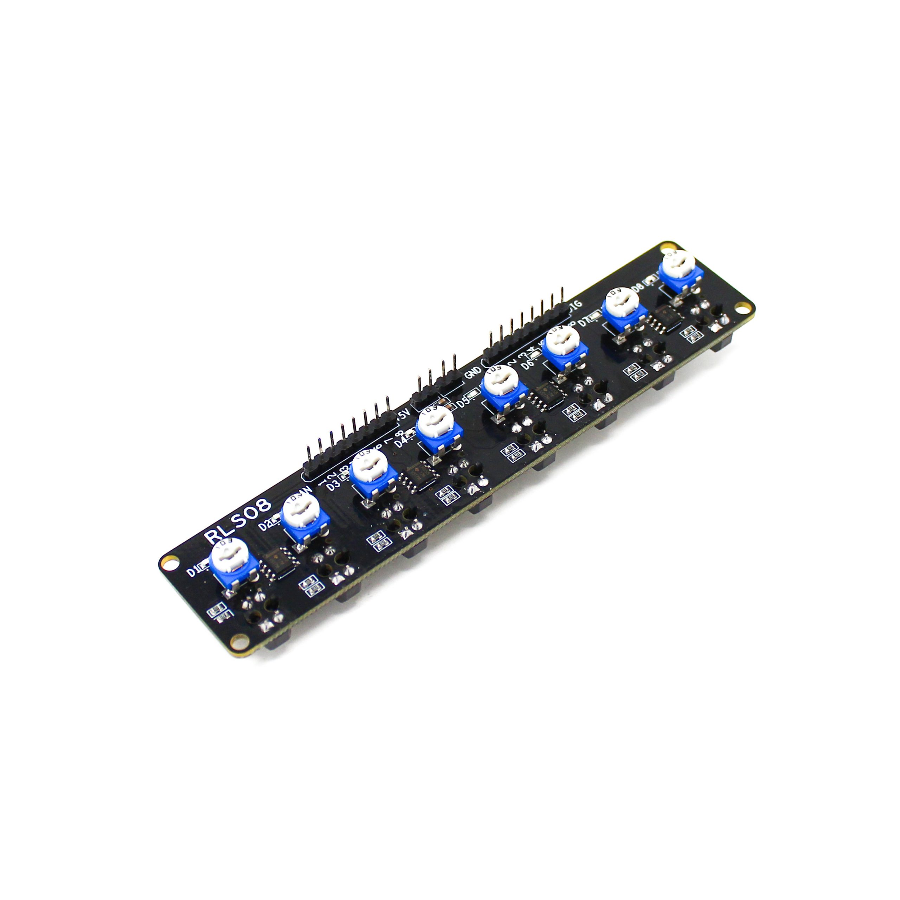
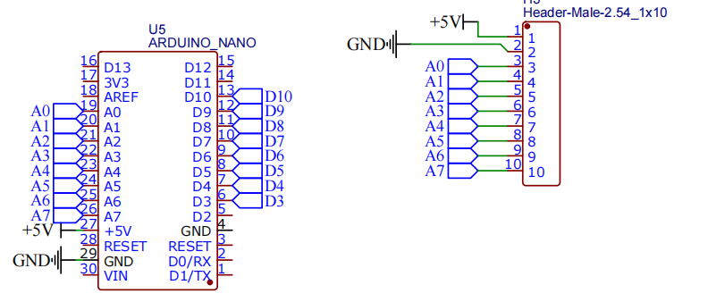
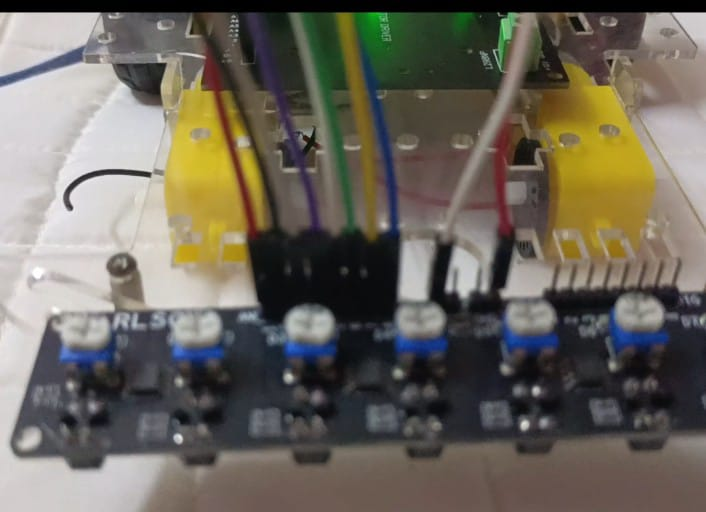
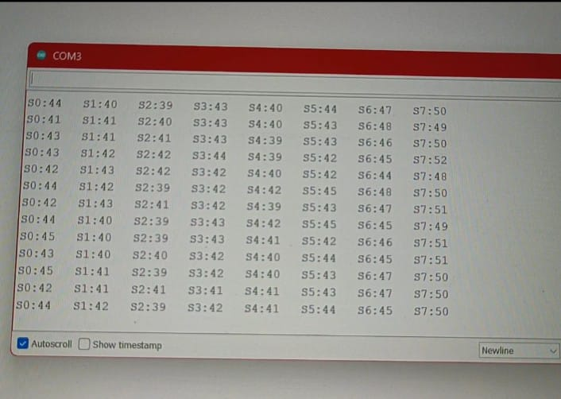

# 🛤️ Line Sensor Array Testing

## Smart Elex RLS-08 Analog & Digital Sensor Calibration

[](https://www.arduino.cc/)
[](https://github.com)
[](https://github.com)

> **Part of:** Advanced Line Follower Robot Project  
> **Purpose:** Testing 8-channel line sensor array for accurate line detection and tracking

---

## 🎯 Objective

Test and calibrate the Smart Elex RLS-08 line sensor array to detect black lines on white surfaces. This 8-channel sensor will be the primary input for line following algorithm.

---

## 🔧 Components Used

| Component | Model | Quantity |
|-----------|-------|----------|
| Microcontroller | Arduino Nano | 1 |
| Line Sensor Array | Smart Elex RLS-08 | 1 |
| Breadboard | Standard | 1 |
| Jumper Wires | Female-to-Male | 11 |
| USB Cable | Mini USB | 1 |
| Test Surface | Black line on white | 1 |

---

## 📊 About RLS-08 Sensor

### Features & Specifications

| Feature | Specification |
|---------|---------------|
| Number of Sensors | 8 IR sensor pairs |
| Sensor Type | Reflective IR (Infrared) |
| Output Type | Analog + Digital |
| Operating Voltage | 5V DC |
| Detection Range | 1-15mm (optimal 2-3mm) |
| Sensor Spacing | Evenly distributed |
| Array Width | ~60mm |
| Response Time | <1ms |
| Output Logic | LOW = Black, HIGH = White (Digital) |

### How It Works

Each of the 8 sensors contains:
- **IR LED** → Emits infrared light
- **Photodiode** → Detects reflected light

**Detection Principle:**
- **White Surface** → High reflection → High analog value (800-1023)
- **Black Line** → Low reflection → Low analog value (0-300)
- **Threshold** → Adjustable via onboard potentiometers

---

## 📐 Circuit Diagram

### Pin Connections

```
┌───────────────────────┐          ┌──────────────┐
│     RLS-08 Sensor     │          │ Arduino Nano │
├───────────────────────┤          ├──────────────┤
│                       │          │              │
│  VCC     ─────────────┼──────────┼───  5V       │
│  GND     ─────────────┼──────────┼───  GND      │
│                       │          │              │
│  S1 (Analog)  ────────┼──────────┼───  A0       │
│  S2 (Analog)  ────────┼──────────┼───  A1       │
│  S3 (Analog)  ────────┼──────────┼───  A2       │
│  S4 (Analog)  ────────┼──────────┼───  A3       │
│  S5 (Analog)  ────────┼──────────┼───  A4       │
│  S6 (Analog)  ────────┼──────────┼───  A5       │
│  S7 (Analog)  ────────┼──────────┼───  A6       │
│  S8 (Analog)  ────────┼──────────┼───  A7       │
│                       │          │              │
└───────────────────────┘          └──────────────┘
```

### Connection Table

| RLS-08 Pin | Arduino Nano Pin | Description |
|------------|------------------|-------------|
| VCC | 5V | Power supply |
| GND | GND | Ground |
| S1 | A0 | Sensor 1 (Leftmost) |
| S2 | A1 | Sensor 2 |
| S3 | A2 | Sensor 3 |
| S4 | A3 | Sensor 4 |
| S5 | A4 | Sensor 5 |
| S6 | A5 | Sensor 6 |
| S7 | A6 | Sensor 7 |
| S8 | A7 | Sensor 8 (Rightmost) |

**Note:** Arduino Nano has analog pins A0-A7, mapped as 0-7 in `analogRead()`

---

## 💻 Code

### Arduino Test Code

```cpp
void setup() {
  Serial.begin(9600);
  Serial.println("RLS-08 Analog Sensor Test");
}

void loop() {
  for (int i = 0; i < 8; i++) {
    int value = analogRead(i);   // Reads A0–A7 (mapped as 0–7)
    Serial.print("S");
    Serial.print(i);
    Serial.print(":");
    Serial.print(value);
    Serial.print("\t");
  }
  Serial.println();
  delay(300);
}
```
[linefollower sensor_testing_code](lr.ino)
### Code Explanation

- **Line 2:** Initialize serial communication at 9600 baud
- **Line 3:** Print header message for identification
- **Line 7:** Loop through all 8 sensors (0-7)
- **Line 8:** Read analog value from each sensor (0-1023 range)
- **Line 9-12:** Format and print sensor number with its value
- **Line 13:** Print tab character for spacing
- **Line 15:** New line after all 8 sensors
- **Line 16:** 300ms delay between readings (~3 readings/second)

### Output Format

```
RLS-08 Analog Sensor Test
S0:850  S1:842  S2:856  S3:845  S4:841  S5:848  S6:852  S7:839
S0:145  S1:138  S2:850  S3:842  S4:845  S5:848  S6:142  S7:135
```

---

## 🧪 Testing Results

### Test Environment

**Surface:** Black electrical tape on white paper/board  
**Line Width:** 15-20mm  
**Height:** 2-3mm above surface (optimal)  
**Lighting:** Indoor ambient light  

### Sensor Reading Values

#### On White Surface
```
S0:850  S1:842  S2:856  S3:845  S4:841  S5:848  S6:852  S7:839
```
📊 **Range:** 839 - 856 (High values indicate white/reflective surface)

#### On Black Line (Center Sensors)
```
S0:845  S1:842  S2:145  S3:138  S4:142  S5:148  S6:850  S7:839
```
📊 **Range:** 135 - 150 (Low values indicate black/non-reflective surface)

#### Line Positioned at Left
```
S0:142  S1:138  S2:135  S3:845  S4:841  S5:848  S6:852  S7:839
```
🎯 **Sensors S0, S1, S2 detect the line**

#### Line Positioned at Right
```
S0:850  S1:842  S2:856  S3:845  S4:841  S5:142  S6:145  S7:138
```
🎯 **Sensors S5, S6, S7 detect the line**

### Calibration Data

| Surface Type | Typical Reading | Threshold |
|--------------|----------------|-----------|
| White (reflective) | 800 - 1023 | > 500 |
| Gray (partial) | 400 - 600 | 400-600 |
| Black (absorbing) | 0 - 300 | < 400 |

**Recommended Threshold:** **400-500** (adjust based on your surface)

---

## 📊 Understanding Sensor Array

### Sensor Layout

```
  S0   S1   S2   S3   S4   S5   S6   S7
  ●    ●    ●    ●    ●    ●    ●    ●
  └────┴────┴────┴────┴────┴────┴────┘
 LEFT                              RIGHT
```

### Line Position Detection

```
Case 1: Line at Center
  ○    ○    ●    ●    ●    ○    ○    ○
  White     Black line      White

Case 2: Line at Left
  ●    ●    ○    ○    ○    ○    ○    ○
  Black     White surface

Case 3: Line at Right
  ○    ○    ○    ○    ○    ●    ●    ●
  White     Black line

Case 4: Sharp Left Turn
  ●    ●    ●    ●    ○    ○    ○    ○
  Black line turning left

● = Sensor detecting black (LOW reading)
○ = Sensor detecting white (HIGH reading)
```

---

## 📸 Demo

### Testing Images

**Sensor Array Module:**
<p align="center">
  
</p>

*Smart Elex RLS-08 8-channel sensor array*

**Circuit Wiring:**
<p align="center">
  
</p>

*Complete wiring with Arduino Nano*

**Line Detection Setup:**
<p align="center">
  
</p>

*Sensor setup*

**Serial Monitor Readings:**
<p align="center">
  
</p>

*Real-time analog values from all 8 sensors*

### Video Demonstration

🎥 **[Watch Testing Video](https://drive.google.com/file/d/11C-m_cBv2OW21S-5s31K-cQOErQuUmAr/view?usp=sharing)**

*Video demonstrates:*
- Sensor array detecting line at different positions
- Serial monitor showing real-time analog values
- Response time and accuracy
- Moving sensor across the line

---

## 🚀 Upload Instructions

### Step-by-Step Guide

1. **Prepare Hardware**
   - Connect all 8 analog pins (A0-A7)
   - Connect VCC to 5V and GND to GND
   - Ensure sensor is 2-3mm above test surface

2. **Open Arduino IDE**
   ```
   Tools → Board → Arduino Nano
   Tools → Processor → ATmega328P (Old Bootloader)
   Tools → Port → Select your COM port
   ```

3. **Upload Code**
   - Copy the test code above
   - Click "Upload" button
   - Wait for "Done uploading"

4. **Test with Serial Monitor**
   - Open Serial Monitor (Ctrl + Shift + M)
   - Set baud rate to **9600**
   - Place sensor over white surface
   - Note high values (800-1023)
   - Move black line under sensors
   - Observe values drop (0-300)

---

## 🔍 Sensor Calibration Tips

### Optimal Setup

✅ **Height:** 2-3mm above surface (critical!)  
✅ **Surface:** Matte finish works best  
✅ **Line Width:** 15-25mm for best detection  
✅ **Contrast:** Maximum black/white difference  
✅ **Lighting:** Consistent ambient light  

### Common Issues & Solutions

| Issue | Cause | Solution |
|-------|-------|----------|
| All sensors read ~1023 | Too far from surface | Lower sensor closer (2-3mm) |
| All sensors read ~0 | Too close to surface | Raise sensor height slightly |
| Inconsistent readings | Uneven surface | Ensure flat test track |
| Poor contrast | Similar colors | Use pure black and white |
| Flickering values | Loose connections | Check all wire connections |
| Some sensors not working | Faulty sensor/connection | Test each pin individually |

---

## 💡 Key Learnings

### What Worked Well

✅ All 8 sensors responding correctly  
✅ Clear distinction between black and white  
✅ Fast response time suitable for line following  
✅ Analog output provides gradual values for position estimation  
✅ Consistent readings across multiple tests  
✅ Easy to interface with Arduino's analog pins  

### Observations

📌 **Threshold varies with:**
- Surface material (glossy vs matte)
- Ambient lighting conditions
- Sensor height from surface
- Quality of black tape/paint

📌 **Best performance:**
- Matte black tape on matte white surface
- Indoor consistent lighting
- 2-3mm height (sweet spot)
- Sensor perpendicular to surface

### Challenges Faced

⚠️ Initial readings fluctuated due to incorrect height  
⚠️ Glossy surfaces caused reflection issues  
⚠️ Ambient light changes affected readings slightly  

### Solutions Implemented

✔️ Fixed sensor at optimal 2-3mm height  
✔️ Used matte black tape instead of glossy  
✔️ Tested under consistent lighting  
✔️ Added delay(300) to stabilize readings  

---

## 📝 Testing Checklist

- [✔] All 8 sensors connected properly
- [✔] Power supply stable at 5V
- [✔] Serial communication working
- [✔] White surface detection (high values)
- [✔] Black line detection (low values)
- [✔] Left position detection tested
- [✔] Center position detection tested
- [✔] Right position detection tested
- [✔] Response time measured
- [✔] Optimal height determined (2-3mm)
- [✔] Threshold values calibrated

---

## 📞 Troubleshooting

**Problem:** Sensor readings are all the same  
**Solution:** Check if all 8 wires are connected to correct analog pins

**Problem:** Values jumping randomly  
**Solution:** Secure all connections, check for loose wires

**Problem:** Can't differentiate black from white  
**Solution:** Adjust sensor height, improve surface contrast

---

**Status:** ✅ Testing Complete - Ready for Integration
 
**Tested By:** Dhinekka B 
**Calibrated Threshold:** 400-500 (adjust for your setup)

---

*Part of the Advanced Line Follower Robot Project*